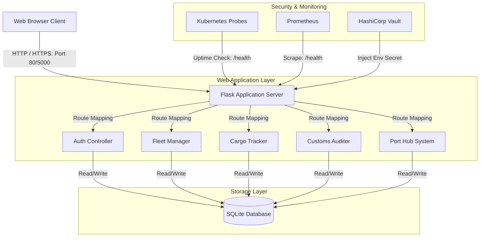
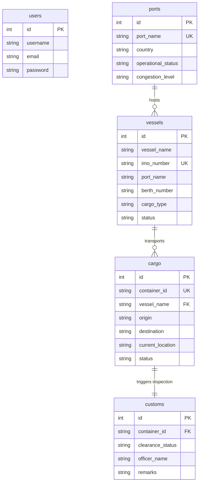

# System Architecture - HarborNet Platform

This document describes the structural layout, logical architecture, data design, and deployment design of the **HarborNet – Global Port & Maritime Logistics Control Platform**.

---

## 1. High-Level Architecture Overview

HarborNet uses a multi-tier architectural pattern. The system consists of a web client, a Python Flask application server, an SQLite relational database, and supporting infrastructure layers.



---

## 2. Component Design

1. **User Client**: Serves responsive HTML/Bootstrap 5 templates to operators.
2. **Application Server (Flask)**:
   - **Authentication System**: Secures access using hashed passwords (`werkzeug.security`) and cookie-based session state (`flask.session`).
   - **Health Endpoint (`/health`)**: Public API returning JSON server state for load balancers and container orchestrators.
   - **Database Helpers**: Establishes SQLite connection streams, initializes table structures, and seeds mock records on startup.
3. **Database (SQLite)**: File-based relational storage engine (`harbornet.db`). Extremely fast, lightweight, and zero-configuration, making it perfect for rapid deployments.

---

## 3. Data Relationships (ERD)

The database tables are linked relationally through IDs and string keys to coordinate real-time tracking:



---

## 4. Infrastructure Deployment Lifecycle

The HarborNet platform implements DevOps infrastructure-as-code principles at every stage of development:

```
+------------+     +-------------------+     +------------------+     +------------------------+
| Local Git  | --> | Jenkins CI Build  | --> | Docker Image Hub | --> | Kubernetes Cluster /   |
| Commit     |     | (Syntax & Docker) |     | (Version Tags)   |     | AWS EC2 Node (Terraform)|
+------------+     +-------------------+     +------------------+     +------------------------+
```

* **Version Control**: Infrastructure state stored in git alongside application code.
* **CI/CD Pipeline**: Jenkins Declarative Pipeline automates quality gates, dependencies management, and image containerization.
* **Orchestration**: Kubernetes schedules redundant Pods, manages port mappings, and isolates secret files.
* **Infrastructure Provisioning**: Terraform structures AWS environments (VPCs, Subnets, Routing, and Security Policies).
* **Uptime Scrapes**: Prometheus logs metric charts directly from `/health` hooks.
